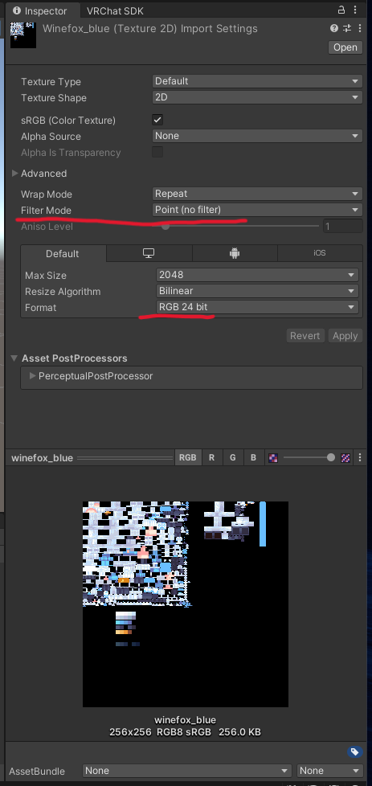

# 酒狐 VRChat 模型 工程文件

酒狐(角色) 来自 [我的世界(minectaft)](https://www.minecraft.net/) 的 [车万女仆(Touhou Little Maid)](https://modrinth.com/mod/touhou-little-maid/versions) 模组。

原作者 godzilla256‚ 星屑海螺

改编者 YWsuoyi

该模型评分在Windows为Excellent，在Android和IOS为good。

该模型的耳朵，头发，蝴蝶结，尾巴，裙子，均存在物理或模拟的物理效果。

##### 关于贴图

如果你需要其他颜色的贴图，可在如下位置找到

* 车万女仆官方github仓库\
  [https://github.com/TartaricAcid/TouhouLittleMaid/tree/1.20/src/main/resources/assets/touhou\_little\_maid/tlm\_custom\_pack/touhou\_little\_maid-1.0.0/assets/geckolib/textures/entity](https://github.com/TartaricAcid/TouhouLittleMaid/tree/1.20/src/main/resources/assets/touhou_little_maid/tlm_custom_pack/touhou_little_maid-1.0.0/assets/geckolib/textures/entity)

* 解压车万女仆的模组jar文件\
  路径为 assets/touhou\_little\_maid/tlm\_custom\_pack/touhou\_little\_maid-1.0.0/assets/geckolib/textures/entity
  
任何寻找任何以wine\_fox开头的png即可。

注意，你需要在unity中将贴图的过滤模式设为Point来避免贴图变得模糊！

##### 统计信息

* 解压大小：1.93MB
* 纹理显存占用：0.34MB
* 三角面总数：4770
* PhyBone组件：3
* PhyBone变换：15
* PhyBone碰撞体：2
* PhyBone碰撞检测：2
* 约束：25
* 约束链长度：7
* 骨骼：53

##### 项目文件

winefox.gltf -- 由blockbench直接从json模型转换而来。

酒狐.blend -- 未合并的blender源文件（旧的）。

酒狐合并.blend -- 合并后的blender源文件，同时相比于未合并版本做了大量调整（这俩文件不只是有没有合并的关系，它们在时间上差了很多，一般认为未合并版本仅供参考，没有实际价值）。

酒狐合并.fbx -- 由最新的 酒狐合并.blend 直接导出得到。

wine fox.unity -- 导出的unity package，用于更方便的导入。

asstes文件夹 -- 包含用于在unity中搭建该Avatar需要的全部文件。

### 授权协议 / License
本项目模型资产基于 Touhou Little Maid 模组进行二次创作，遵循 CC BY-NC-SA 4.0 (署名-非商业性使用-相同方式共享) 协议发布。
1. 署名 (Attribution)
在使用、修改或分发本模型时，必须保留并注明以下贡献者信息：
- 原作者： godzilla256, 星屑海螺 (来自 车万女仆模组)
- 改编者： YWsuoyi
2. 非商业性使用 (Non-Commercial)
- 禁止将本项目中的任何资产用于商业用途。
- 禁止在未经许可的情况下，将此模型打包在任何付费资源包或代购服务中。
- 例外： 允许在 VRChat 等平台作为个人公开/私有形象使用。
3. 相同方式共享 (ShareAlike)
- 如果你对本项目进行了修改、转换格式或以此为基础进行再创作，你必须采用与本协议相同的 CC BY-NC-SA 4.0 协议来分发你的作品。
